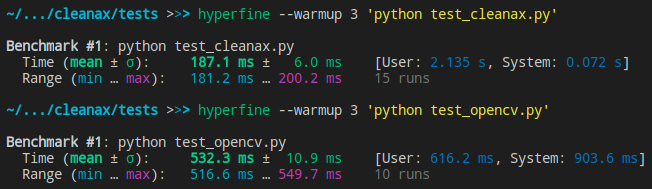

# Cleanax 🧹

Zero-configuration dataset cleaner. Automatically detect solid color images and let the user delete them.

An image is completely red? 🍎 DELETE IT

An image is completely yellow? 🍌 DELETE IT

An image is a scenery? 🎑 KEEP IT

## Purpose

I spent a lot of time trying to extract a bunch of images from anime series (a frame each 8 seconds for example), but I encounter a series of problem... First, some images are completely black, completely white or duplicated. After some research over the internet, the reality is sad :/ There isn't a proper and efficient way to delete such annoying images. That's why I decided to create `cleanax`. The automated and fast way to automatically flag noise from a visual dataset.

## Features

- [x] Flag solid color images
- [x] Flag corrupted image or non-image file
- [ ] Flag duplicated images

Features are demonstrated with the tests folder. The following images are flagged as noise:

* 48971.png
* 54987.png
* 62410.png
* 70864.png

## Performance

Not gonna lie, it's surprisingly fast:



Benchmark is run on the `tests` folder containing 11 images of size 1920 * 1080. The opencv piece of code simply checks wether images are completely black and this method may be sub-optimized.`cleanax` still offer an easier way to achieve dataset cleaning. (Performance are often I/O bound. Reading from an old hdd will be slower than reading from a new ssd.)

## Usage

`cleanax` targets ease-of-use and thus, is distributed as a python package (undergoing deploiement on https://pypi.org/).

```
pip install cleanax
```

```python
import os
import cleanax

# Files name flagged as noise
to_delete = cleanax.clean("path/to/img/")

# Delete them
for f in to_delete:
    os.remove("path/to/img/" + f)
```

## Compiling

You may want to use the latest version of cleanax possible.

```
git clone https://github.com/vinhig/cleanax
cd cleanax
cargo build --release
cp target/release/libcleanax.so ./cleanax.so
```

You can import this library the same way as any other python file:

```python
import cleanax
```

## Warranty

`cleanax` is not meant to be a "high-quality software with a high liability", but rather a tool I *heavily* use myself during the composition of my datasets.